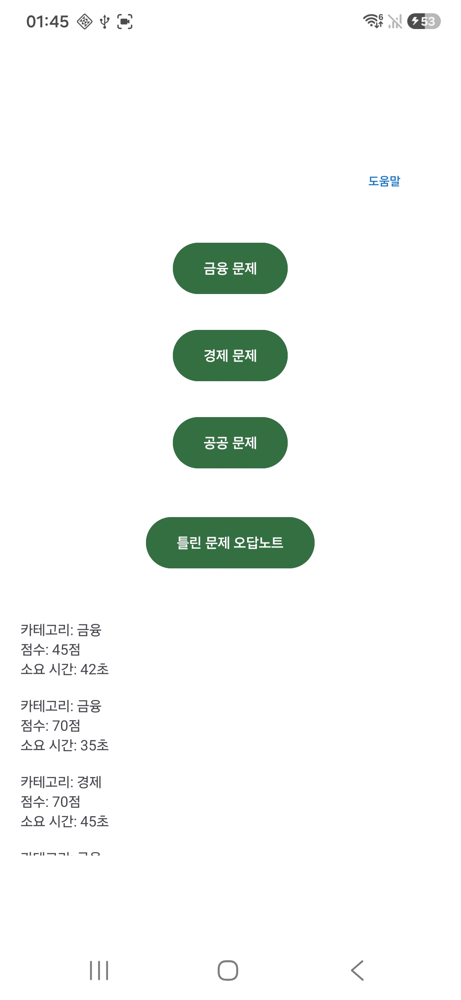
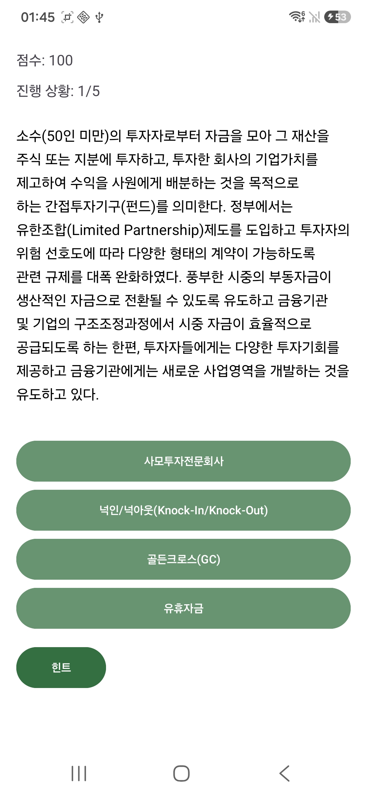
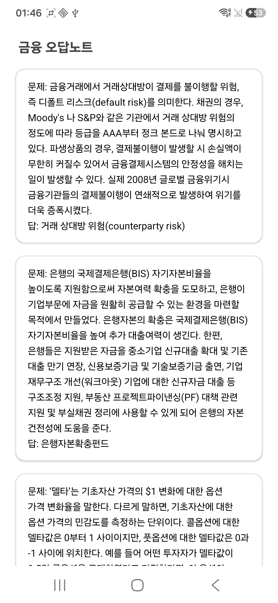
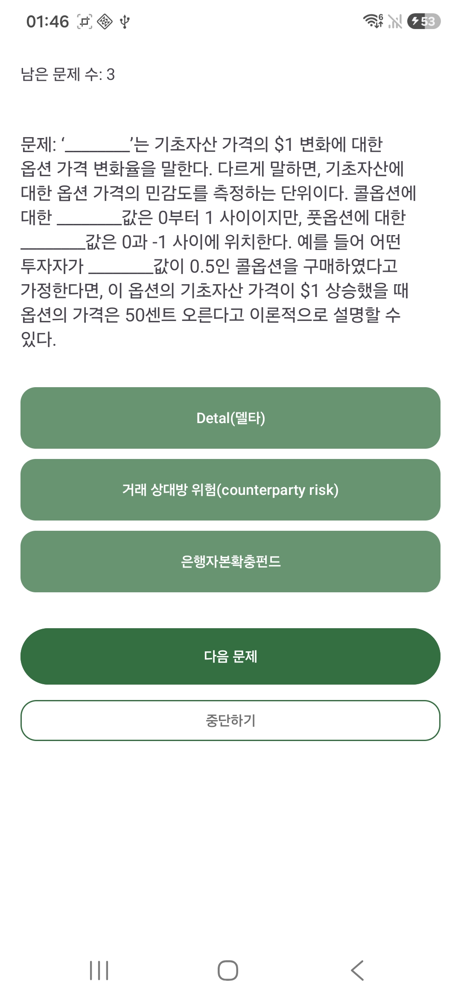

# 시사경제 퀴즈

경제·금융·공공 분야의 시사·경제 용어를 설명 중심의 4지선다와 반복 복습으로 학습하는 고등학생과 시사·경제 학습 입문자를 위한 Android 앱

## 실행 화면

### 주요 학습 흐름

<table>
  <tr>
    <th>홈</th>
    <th>카테고리 퀴즈</th>
    <th>힌트 및 틀린 문제 복습</th>
  </tr>
  <tr>
    <td></td>
    <td></td>
    <td></td>
  </tr>
</table>

### 오답 관리 흐름

<table>
  <tr>
    <th>틀린 문제 오답노트</th>
    <th>오답 복습 퀴즈</th>
  </tr>
  <tr>
    <td></td>
    <td></td>
  </tr>
</table>

### 실행 영상

[전체 학습 흐름 영상 보기](git_media/금경공시사화면녹화.mp4)

## 프로젝트 배경

앱프로그래밍 기초 및 실습 수업의 개인 과제로 시작하여, 공공데이터로 제공된 시사경제용어사전을 퀴즈로 재구성한 Android 학습 프로젝트. 단순히 무작위 출제라기보다 문제 풀이, 재시도, 힌트, 즉시 복습, 영구 오답노트가 하나의 학습 흐름으로 이어지는 구조를 목표로 하였음.

## 기술 구성

| 구분 | 적용 기술 |
| --- | --- |
| 언어·플랫폼 | Java, Android SDK |
| 화면 전환 | Activity, Intent |
| 문제 데이터 | assets JSON, `QuizData`, `Question` 모델 |
| 로컬 저장 | SharedPreferences, Gson |
| 검증 | JUnit 기반 정답 마스킹 단위 테스트 |

## 사용자 학습 목표

- 단순 암기보다 설명을 통한 경제 용어 구분 학습
- 경제, 금융, 공공 카테고리 기반 분야별 학습
- 힌트 사용 및 오답 문항을 활용한 취약 용어 반복 학습
- 앱 재실행 후에도 이어지는 오답노트 복습

## 핵심 기능

- 선택한 카테고리에서 매회 5문제 무작위 출제
- 100점 시작, 오답 10점·힌트 5점 감점 방식
- 힌트를 통한 오답 선택지 단계별 제거 및 문제 건너뛰기 지원
- 결과 화면의 `힌트 및 틀린 문제 복습하기`에 힌트 사용·오답 문항 표시
- `틀린 문제 오답노트`에 실제 오답 문항만 카테고리별 저장
- 오답 복습 퀴즈에서 정답 처리된 문항의 오답노트 자동 제거

## 문제 해결 요약

| 해결 과제 | 적용 방식 | 설계 이유 |
| --- | --- | --- |
| 설명 문장 속 정답 노출 | 정답·띄어쓰기 변형·영문 별칭·후행 괄호 표현의 실행 시점 마스킹 | 원본 데이터 보존과 퀴즈용 문장 생성의 분리 |
| 오답 선택지 중복 | 같은 카테고리의 정답 목록에서 현재 정답을 제외한 서로 다른 용어 3개 추출 | 항상 4개의 구분 가능한 선택지 제공 |
| 힌트와 오답 상태 혼합 | 힌트 사용 문제와 실제 오답 문제의 별도 컬렉션 관리 | 즉시 복습과 영구 오답노트의 목적 분리 |
| 선택지 상태의 다음 문제 잔류 | 문제 전환 시 선택·활성·힌트·정답 상태의 문제 단위 초기화 | 이전 문제의 상호작용이 새 문제에 영향을 주는 오류 방지 |
| 중복 채점과 중복 이동 | 정답 확정 후 입력 잠금과 이동 상태 분리 | 점수 중복 반영과 연속 화면 전환 방지 |
| 화면 전환 후 Activity 중복 | 기존 메인 화면 재사용과 현재 복습 화면 종료 중심의 백스택 관리 | 뒤로가기 시 종료된 화면이 다시 나타나는 흐름 방지 |

## 핵심 설계

### 데이터 분리

- 기존 Java 코드에 하드코딩된 문제 데이터 대신 `quiz_data.json` 기반으로 데이터를 아예 분리
- `quiz_data.json` → `QuizData` → `Question` 데이터 로딩 흐름
- 저장 데이터 호환용 영문 내부 키와 사용자 화면용 한국어 카테고리 표시 구조
- Java 코드 수정 없이 같은 카테고리의 문제 추가·교체가 가능한 유지보수 구조
- 현재 정답을 제외한 서로 다른 용어 3개를 오답으로 추출하는 중복 방지 선택지 구성

#### JSON 구조와 로컬 배치

- `quiz_data.json` 공개 저장소 제외(아래와 같은 구조로 포맷만 변환하여 사용)
- 로컬 실행용 파일 경로: `app/src/main/assets/quiz_data.json`
- UTF-8 인코딩과 아래 구조를 만족하는 로컬 데이터 파일 필요
- 선택지 배열을 저장하지 않고 같은 카테고리의 정답 목록에서 실행 시 오답 3개 생성

```json
{
  "economy": [
    {
      "questionText": "경제 분야 용어 설명",
      "answer": "정답 용어"
    }
  ],
  "finance": [
    {
      "questionText": "금융 분야 용어 설명",
      "answer": "정답 용어"
    }
  ],
  "public": [
    {
      "questionText": "공공 분야 용어 설명",
      "answer": "정답 용어"
    }
  ]
}
```

| 필드 | 역할 |
| --- | --- |
| `economy`, `finance`, `public` | 카테고리별 문항 배열 (원본 데이터상 '주제' 컬럼) |
| `questionText` | 문제로 표시할 용어 설명 원문 (원본 데이터상 '설명' 컬럼) |
| `answer` | 해당 설명의 정답 용어 (원본 데이터상 '용어' 컬럼) |

> 데이터 파일 미배치 시 앱 실행 후 카테고리 문제 로딩 불가

### 정답 노출 방지

- 정답 용어, 영문 별칭, 공백이 다른 표기의 `________` 마스킹 처리
- 정답 바로 뒤에 붙은 괄호 설명의 동시 마스킹
- 정답 처리 후와 오답노트·복습 화면 확인을 위한 원문 별도 보존
- 원본 설명을 직접 수정하지 않으면서 문제 풀이 중 정답 노출만 차단하기 위한 런타임 마스킹 방식

### 4지선다와 힌트 상태 관리

- 정답 1개와 오답 3개로 구성된 4지선다 구조
- 힌트 1회당 현재 활성 상태인 오답 선택지 1개 제거
- 제거 가능한 오답 3개를 기준으로 한 문제당 최대 3회의 힌트 사용 가능
- 사용자가 직접 고른 오답 선택지만 비활성화하고 나머지 선택지는 계속 선택 가능한 재시도 구조
- 오답 선택이나 힌트 사용 이후 문제 건너뛰기를 허용하는 학습 선택권 보장
- 정답 선택 이후 모든 추가 입력을 잠가 중복 채점과 두 문제 연속 이동 방지
- 다음 문항 표시 시 모든 선택지와 힌트 상태 초기화

| 문제 상태 | 선택지 상태 | 힌트 상태 | 다음 문제 | 설계 목적 |
| --- | --- | --- | --- | --- |
| 문항 시작 | 4개 활성 | 활성 | 비활성 | 문제 풀이 전 건너뛰기 방지 |
| 힌트 사용 | 오답 1개씩 비활성 | 제거할 오답이 남은 동안 활성 | 활성 | 단계적 난이도 완화와 복습 대상 기록 |
| 오답 선택 | 선택한 오답만 비활성 | 남은 선택지 수에 따라 재계산 | 활성 | 재시도 또는 건너뛰기 선택 제공 |
| 정답 선택 | 전체 비활성 | 비활성 | 비활성 | 중복 입력 차단과 자동 전환 단일화 |
| 다음 문항 | 4개 활성 상태로 초기화 | 활성 상태로 초기화 | 비활성 | 이전 문항 상태 유입 방지 |

### 복습 상태 분리

- `reviewQuestions`: 현재 회차의 힌트 사용·오답 문항 중복 제거 관리
- `wrongQuestions`: 실제 오답 문항 관리 및 `SharedPreferences` JSON 저장
- 힌트 사용 문항의 즉시 복습과 실제 오답 문항의 영구 저장을 구분한 목록 분리 구조
- 힌트 사용을 실제 오답과 동일하게 영구 저장하지 않기 위한 학습 기록 분리
- 현재 회차 복습과 장기 오답 복습을 구분하기 위한 서로 다른 생명주기 적용

### 화면과 저장 흐름

```text
메인 → 카테고리 퀴즈 → 결과 → 힌트 및 틀린 문제 복습
메인 → 틀린 문제 오답노트 → 카테고리별 오답 → 오답 복습 퀴즈
```

- 화면별 책임 분리를 위한 Activity 단위 구성
- 현재 회차의 카테고리·점수·복습 목록 전달을 위한 Intent 사용
- 소규모 오답 데이터의 로컬 영속화에 적합한 SharedPreferences와 Gson 사용
- 별도 데이터베이스 없이 앱 재실행 후에도 카테고리별 오답을 유지하기 위한 저장 구조
- 결과 화면의 홈 버튼과 시스템 뒤로가기에 동일한 메인 복귀 흐름 적용
- `FLAG_ACTIVITY_CLEAR_TOP`과 `FLAG_ACTIVITY_SINGLE_TOP`을 통한 기존 메인 화면 재사용
- 오답 복습 중단 시 현재 Activity만 종료하고 상세 화면 복귀 후 목록 갱신

## 구현에서 중점적으로 다룬 부분

- 화면 간 데이터 전달과 백스택 관리
- JSON 문제 데이터와 퀴즈 상태의 분리
- 현재 회차 복습과 영구 오답노트의 생명주기 분리


## 실행 과정

1. Android Studio에서 프로젝트 열기
2. `app/src/main/assets/quiz_data.json` 경로에 UTF-8 데이터 파일 배치
3. `economy`, `finance`, `public` 카테고리별 5문항 이상 구성 필요
4. 앱 실행 후 카테고리별 문제 로딩 확인

변환된 실제 데이터 파일은 저장소에서 제외 -> 현재 레포에서는 JSON 구조와 로컬 배치 방법만 공개하였음

## 데이터 출처

- 출처: [경제배움e 시사경제용어사전](https://econedu.go.kr/user/playEcon/currEconTermDoc/menu/list)
- 이용 조건: [공공누리 제3유형](https://www.kogl.or.kr/info/licenseType3.do)
- 원본 XLSX 중 경제·금융·공공 카테고리의 앱 내부 JSON 구조로 활용
- 실제 변환한 JSON은 `.gitignore`를 통해 공개 저장소에서 제외

> 본 저작물은 '재정경제부 경제배움e+'에서 '2024년' 작성하여 공공누리 제3유형으로 개방한 '시사경제용어사전'을 이용하였으며,<br>
> 해당 저작물은 '재정경제부 경제배움e+, [경제배움e 시사경제용어사전](https://econedu.go.kr/user/playEcon/currEconTermDoc/menu/list)'에서 무료로 다운받으실 수 있습니다.
